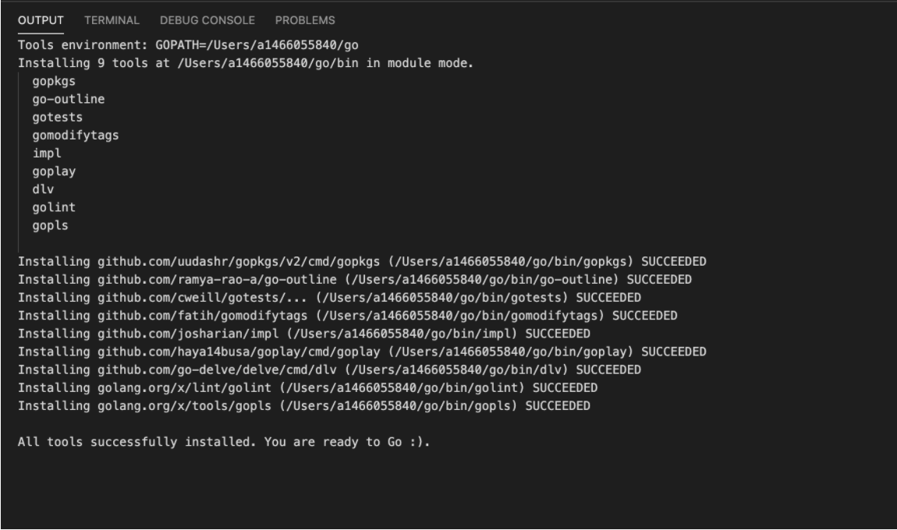
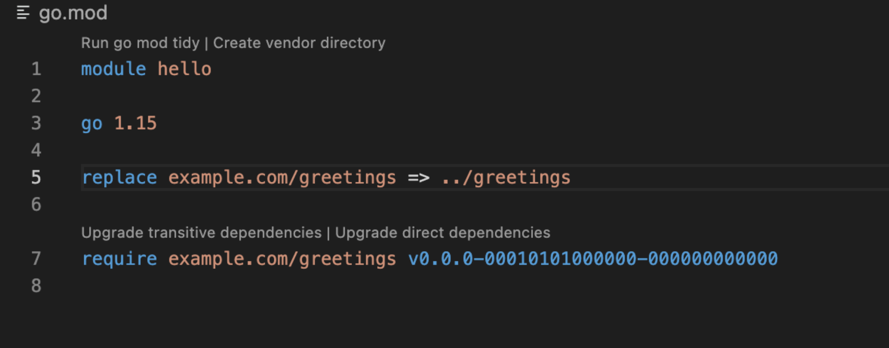

# GO

------

### 安装与环境配置

1. 安装就不多说了，直接翻墙去官网下载安装包，go安装在：usr/local/go

2. 设置环境变量：

   * 命令行输入

     ```c
     vim ~/.bash_profile /*然后在path中添加go/bin路径即可*/
     ```

     

3. 验证成功的方式：

   ```c
   go version
   ```

   

------

### 开发环境配置

1. 使用VScode开发，首先安装go的扩展插件，让VScode支持go语言开发

2. 安装好插件之后要安装开发工具包（自动补全和高亮等）

   * 首先打开terminal设置一下代理，这样就不用翻墙了

     ```c
     go env -w GOPROXY=https://goproxy.cn,direct
     ```

   * 然后打开VScode，command+shift+p，搜索**\>go:install**，全选，确定，等待安装结束

     


------

### 文件介绍

##### .mod文件

1. 当你从其他模块导入package时，这个文件就会被创建，它包括**模块名，go版本，需要的特殊外部模块版本(published)，以及本地模块的位置替换(replace)**



2. 你也可以自己创建一个.mod文件

   ```c
   $ go mod init hello_world
   go: creating new go.mod: module hello_world
   ```

   

##### .sum文件

##### .go文件

源代码文件

##### Vendor文件夹

https://leileiluoluo.com/posts/golang-vendoring.html

简而言之，vendor文件夹内包含下载下来的外部模块源码，且只要引用文件的**同级目录/父级目录……一直向上，存在顺序关系**，有一个文件夹下有vendor文件，且内部含有需要的模块源码，go程序就可以正常运行

------

### 指令介绍

##### go run hello_world.go

before it ran the code, go run located and downloaded the rsc.io/quote module that contains the package you imported. By default, it downloaded the latest version -- v1.5.2. Go build commands are designed to locate the modules required for packages you import.

##### Go build 

主要对依赖进行操作，修改或生成mod文件和vendor文件夹

make Go locate the module and add it as a dependency to the go.mod file.

This command can use the replace directive and other messages provided by the go tools to locate and download the module that will be used

如果是本地模块，则要指明replace，然后本地模块和发行版都会自动生成require语句


------

### 语法技巧

```go
value := fmt.Sprintf("Hi, %v. Welcome!", name)//%v表示按本体输出，就是value
//上述等于下面两行
var value string
value = fmt.Sprintf("Hi, %v. Welcome!", name)

```

